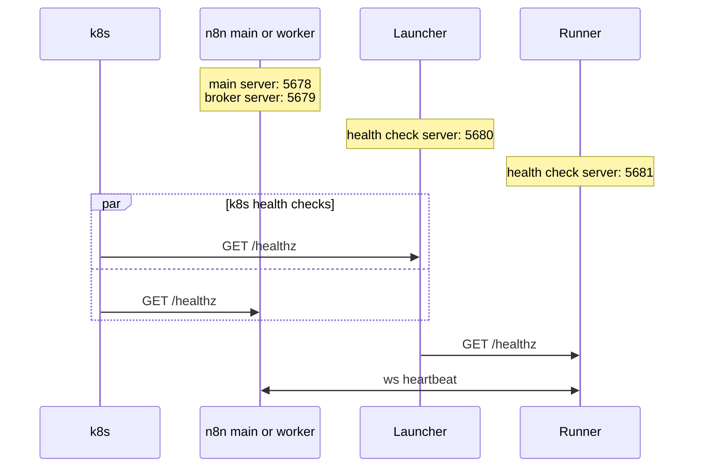

# Setup

To set up the launcher:

1. Download the latest launcher binary from the [releases page](https://github.com/n8n-io/task-runner-launcher/releases).

2. Create a [config file](#config-file) on the host and make it accessible to the launcher.

3. Configure [environment variables](#environment-variables).

4. Deploy the launcher as a sidecar container to an n8n main or worker instance, setting the launcher to manage one or multiple runner types.

```sh
./task-runner-launcher javascript # or
./task-runner-launcher javascript python
```

5. Ensure your orchestrator (e.g. k8s) performs regular liveness checks on both launcher and task broker.

- The launcher exposes a health check endpoint at `/healthz` on port `5680`, configurable via `N8N_RUNNERS_LAUNCHER_HEALTH_CHECK_PORT`.
- The task broker exposes a health check endpoint at `/healthz` on port `5679`, configurable via `N8N_RUNNERS_BROKER_PORT`.

<br>



## Config file

The launcher reads its config file from `/etc/n8n-task-runners.json` by default, or from the file path specified by the `N8N_RUNNERS_CONFIG_PATH` environment variable.

For an example, refer to the [config file](https://github.com/n8n-io/n8n/blob/master/docker/images/runners/n8n-task-runners.json) used in the [`n8nio/runners`](https://hub.docker.com/r/n8nio/runners) Docker image.


| Property       | Description                                                                                                             |
| --------------- | ----------------------------------------------------------------------------------------------------------------------- |
| `runner-type`   | Type of task runner, e.g. `javascript` or `python`. The launcher can manage only one runner per type.                   |
| `workdir`       | Path where the task runner's `command` will run.                                                                                          |
| `command`       | Command to start the task runner.                                                                                       |
| `args`          | Args and flags to use with `command`.                                                                                           |
| `health-check-server-port` | Port for the runner's health check server. When a single runner is configured, this is optional and defaults to `5681`. When multiple runners are configured, this is required and must be unique per runner.
| `allowed-env`   | Env vars that the launcher will pass through from its own environment to the runner. See [environment variables](#environment-variables).
| `env-overrides` | Env vars that the launcher will set directly on the runner. See [environment variables](#environment-variables).

## Environment variables

It is required to pass `N8N_RUNNERS_AUTH_TOKEN` to the launcher and to the n8n instance. This token will allow the launcher to authenticate with the n8n instance and to obtain a grant tokens for every runner it manages. All other env vars are optional and are listed in the [n8n docs](https://docs.n8n.io/hosting/configuration/environment-variables/task-runners).

For any environment variable, you can append `_FILE` to specify a file path to read a value from. For example: `N8N_RUNNERS_AUTH_TOKEN_FILE=/path/to/auth-token.txt`

The launcher can pass env vars to task runners in two ways, as specified in the [config file](#config-file):

| Source | Description | Purpose |
|--------|-------------|------------|
| `allowed-env` | Env vars filtered from the launcher's own environment | Passing env vars common to all runner types |
| `env-overrides` | Env vars set by the launcher directly on the runner, with precedence over `allowed-env` | Passing env vars specific to a single runner type |

Exceptionally, these four env vars cannot be disallowed or overridden:

- `N8N_RUNNERS_TASK_BROKER_URI`
- `N8N_RUNNERS_GRANT_TOKEN`
- `N8N_RUNNERS_HEALTH_CHECK_SERVER_ENABLED=true`
- `N8N_RUNNERS_HEALTH_CHECK_SERVER_PORT`